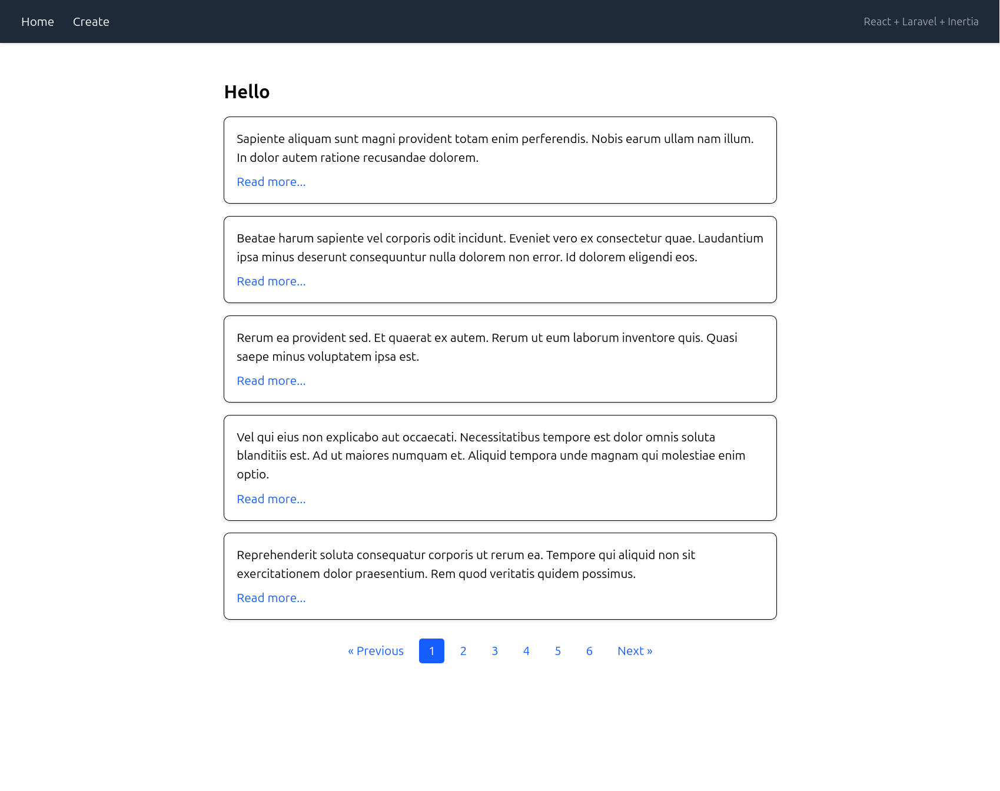
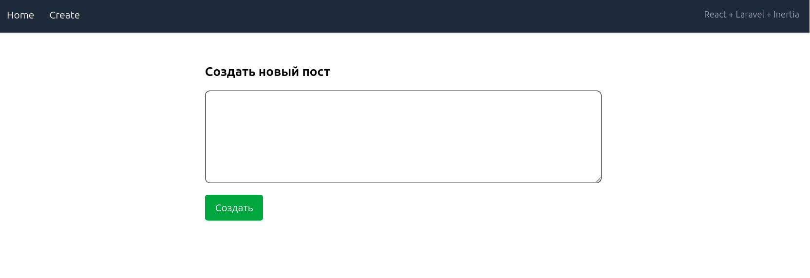
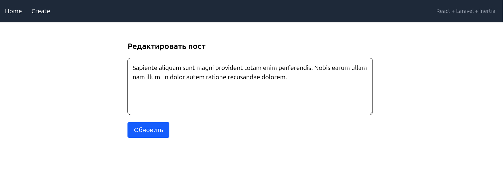
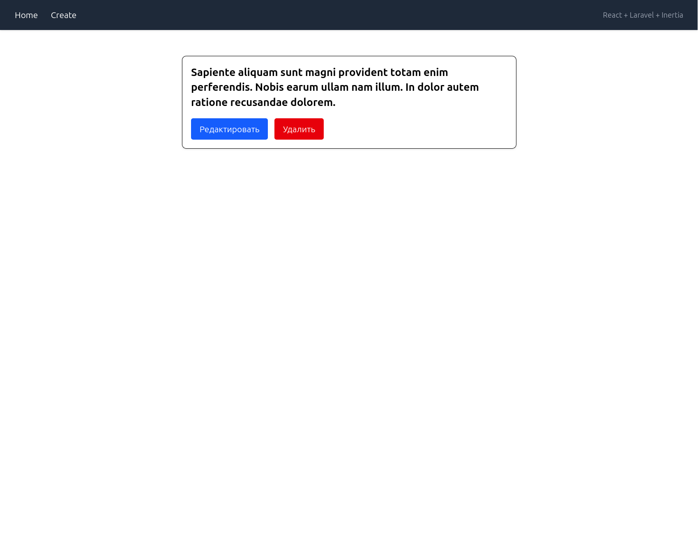

# Описание

Здесь показан при
мер **простого CRUD-приложения**, созданного с использованием  
**Laravel**, **Inertia.js** и **React**.

# Настройка

Запуск
```bash
docker compose up -d
```

Устанавливаем зависимости
```bash
docker compose run composer install
docker compose run node npm install
```

Настройка конфига .env
```bash
cp src/.env.example src/.env
```
> Настроить .env под себя

Ключ и миграции
```bash
docker compose run artisan key:generate
docker compose run artisan migrate
```

Наполнение базы тестовыми данными
```bash
docker compose run artisan db:seed
```
# Скриншоты







